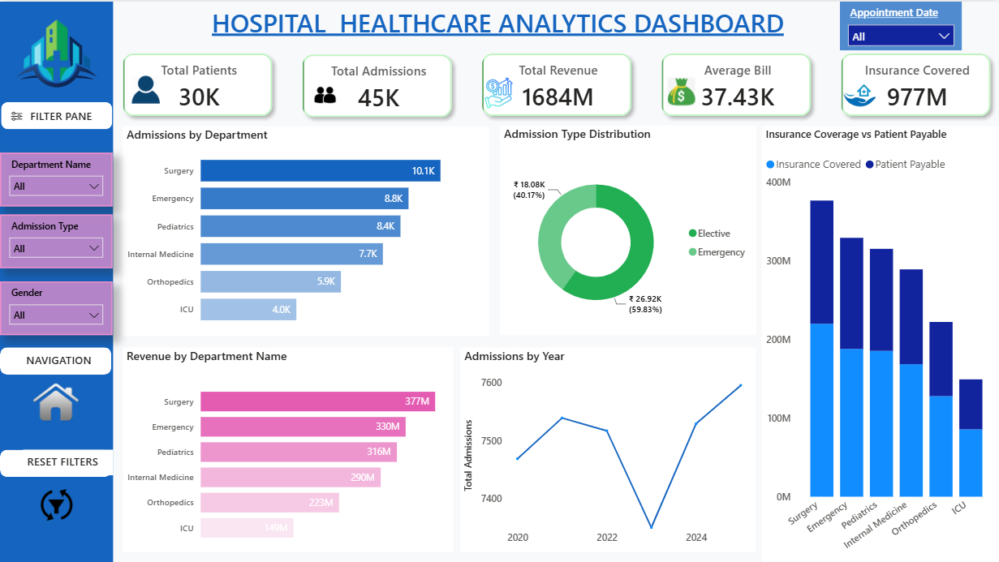
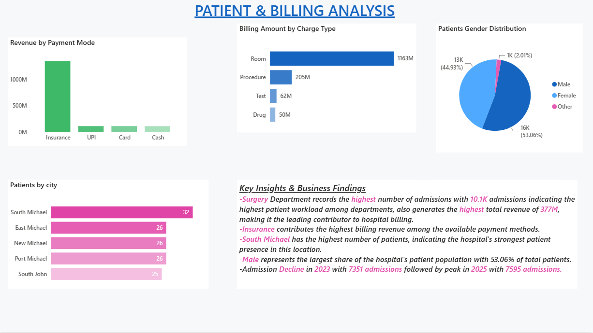

# 🏥 Hospital Healthcare Analytics Dashboard | Power BI

An interactive Power BI dashboard developed to analyze hospital operations, patient admissions, revenue, billing, insurance coverage, and patient demographics.

The project transforms raw healthcare data into meaningful business insights that can help hospital management monitor operational performance, financial trends, and patient distribution.

---

## 📊 Dashboard Preview

### Hospital Overview & Performance

### Patient & Billing Analysis

---

## 🎯 Project Objective

The main objective of this project is to provide a centralized view of hospital performance and answer key business questions such as:

- How many patients and admissions does the hospital have?
- Which departments have the highest number of admissions?
- Which departments generate the highest revenue?
- How is billing divided between insurance and patients?
- Which payment mode contributes the most revenue?
- Which charge type contributes the most to billing?
- Which cities have the highest patient count?
- What is the gender distribution of patients?
- How have admissions changed over the years?

---

## 🗂️ Dataset

The dataset consists of multiple related healthcare tables:

- **Patient** – Patient demographic and registration information
- **Admission** – Patient admission details
- **Billing** – Hospital billing and payment information
- **Billing Detail** – Detailed billing categories
- **Department** – Hospital department information
- **Doctor** – Doctor details and specialization
- **Employee** – Employee information
- **Disease** – Disease categories and details
- **Insurance Provider** – Insurance provider information

The tables were connected using relevant primary and foreign keys to create the Power BI data model.

---

## 🛠️ Tools & Technologies

- **Power BI**
- **Power Query**
- **DAX**
- **Data Modeling**
- **Microsoft Excel / CSV**
- **SQL** for data analysis and query practice

---

## 🔄 Project Workflow

### 1. Data Preparation

The raw healthcare data was imported into Power BI and prepared using Power Query.

Key preparation steps included:

- Checking and correcting data types
- Reviewing null values
- Checking duplicate records
- Validating key columns
- Preparing tables for data modeling

### 2. Data Modeling

Relationships were created between the related healthcare tables based on primary and foreign keys.

The model was validated by checking:

- Relationship cardinality
- Primary and foreign keys
- Cross-filter direction
- Filter propagation between tables

### 3. DAX Measures

Key measures were created to calculate important KPIs.
📑 Dashboard Structure
Page 1 — Hospital Overview & Performance

The first page provides a high-level overview of hospital operations and financial performance.

KPIs
Total Patients
Total Admissions
Total Revenue
Average Bill
Insurance Covered
Visualizations
Admissions by Department
Admission Type Distribution
Revenue by Department
Insurance Covered vs Patient Payable
Admissions by Year
Filters
Appointment Date
Department
Admission Type
Gender
Page 2 — Patient & Billing Analysis

The second page provides a deeper analysis of billing and patient demographics.

Visualizations
Revenue by Payment Mode
Billing Amount by Charge Type
Top 5 Cities by Patient Count
Patient Gender Distribution
Key Insights

The dashboard also includes a Key Insights & Business Findings section summarizing the major findings from the analysis.

🔍 Key Business Insights
Department Performance: Surgery recorded the highest number of admissions with approximately 10.1K admissions and also generated the highest revenue of approximately ₹377M.
Payment Analysis: Insurance contributed the highest billing revenue among the available payment methods.
Billing Analysis: Room charges were the largest billing component, contributing approximately ₹1.163B.
Geographic Distribution: South Michael recorded the highest patient count among the displayed cities.
Patient Demographics: Male patients represented the largest share of the patient population at approximately 53.06%.
Admission Trend: Admissions declined to approximately 7,351 in 2023 before increasing and reaching a peak of approximately 7,595 in 2025.
💡 Business Value

The dashboard can help hospital management:

-Monitor patient admission workload
-Identify high-performing departments
-Understand revenue contribution
-Track insurance and patient payment patterns
-Analyze major billing categories
-Understand patient demographics
-Identify locations with higher patient concentration
-Monitor admission trends over time
📌 Key Power BI Concepts Demonstrated
Data Cleaning with Power Query
Data Modeling
Relationships and Cardinality
Single-direction Filtering
Measures
DAX
DISTINCTCOUNT
SUM
AVERAGE
CALCULATE
Filter Context
Slicers
Top N Filtering
KPI Cards
Interactive Visualizations
Page Navigation
Bookmarks
Dashboard Storytelling
🚀 Future Improvements

Potential future enhancements include:

-Month-over-Month and Year-over-Year analysis
-Department-level drill-through pages
-Advanced KPI targets
-Patient-level drill-through analysis
-Automated data refresh
-Integration with a live SQL database
-More advanced healthcare performance metrics

👩‍💻 Author

Tanvi Hulavale

Aspiring Data Analyst | Power BI | SQL | Advanced Excel | Python
